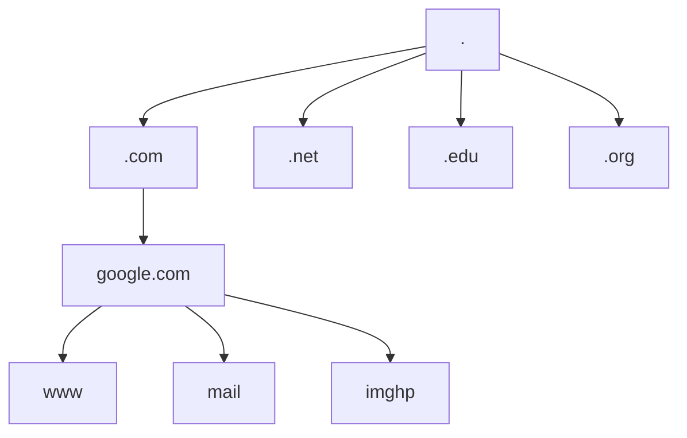

## [[2.11 - Common Ports#DNS - Domain Name System|DNS]] Configuration

#### Domain Name System (DNS)

1. **Purpose:** Translates human-readable domain names into computer-readable [[2.10 - Introduction to IP#IP - Internet Protocol|IP]] addresses.
    
    - Example: `www.google.com` → `142.250.190.68` (the IP address devices use to communicate).
2. **Hierarchical Structure:** DNS is organized in levels:
    - **Root** → **Top-Level Domain (TLD)** → **Second-Level Domain** → **Subdomain/Host**
3. **Distributed Database:**
    - DNS queries are handled by multiple servers worldwide.
    - **13 logical root server clusters** exist, each consisting of multiple physical servers.
    - Hundreds of generic TLDs: `.com`, `.org`, `.net`, `.edu`, etc.
    - Over 275 country-code TLDs: `.us`, `.ca`, `.uk`, `.gr`, etc.
---
#### DNS Hierarchy Diagram




- **Root (`.`):** Top of the hierarchy.
- **TLDs:** Generic (.com, .org) or country-specific (.uk, .gr).
- **Second-Level Domain:** Domain owned/registered (e.g., `google` in `google.com`).
- **Subdomain / Host:** Specific services or hosts (e.g., `www`, `mail`, `imghp`).
---
#### DNS Lookup
- **dig** command (macOS, Linux, some Windows versions via BIND utilities or WSL)
    - Example: `dig www.example.com`
- **nslookup** (Windows built-in)
    - Provides basic DNS query information but fewer options than `dig`.
    - Example: `nslookup www.example.com`
---
#### DNS Records

1. **Resource Records:** Entries in the DNS database.
2. Over 30 record types exist: [[2.10 - Introduction to IP|IP]] addresses, aliases, certificates, etc.
3. These are <span style="color:red">critical</span> DNS configurations; always test and backup settings.
---
#### Address Records (A / AAAA)

- Defines the IP address of a host.
- **A records:** IPv4 addresses. Example: `www.example.com → 192.0.2.1`
- **AAAA records:** IPv6 addresses. Example: `www.example.com → 2001:db8::1`
---
#### Canonical Name Records (CNAME)

- Provides an alias for another canonical name.
- One physical server can serve multiple hostnames.
- Example:
```
; Alias (canonical) names
chat    IN CNAME    www.example.com
ftp     IN CNAME    www.example.com
www     IN CNAME    www.example.com
```
- Advantage: Changing the canonical record automatically updates all aliases.
---
#### Mail Exchange Records (MX)

- Specifies the mail server hostname for a domain (not an IP address).
- Example:
```
example.com     IN    MX    10 mail.example.com
mail.example.com IN    A     54.34.23.234
```
- Ensures emails can be sent to and from the domain properly.
---
#### Text Records (TXT)

- Store human-readable text or machine-verified information.
- Useful for verification, authentication, and security.
- Example:
```
dig www.example.com txt
nslookup -type=txt www.example.com
```
---
#### Email Security Records

**1. DomainKeys Identified Mail (DKIM)**
- Digitally signs outgoing mail from a domain.
- Validated by receiving mail servers.
- The public key is stored in a DKIM TXT record.

**2. Sender Policy Framework (SPF)**
- Lists authorized servers allowed to send emails for the domain.
- Prevents spoofing.
- Example:
```
example.com    300    IN    TXT    "v=spf1 include:maingun.org ~all"
```
---
#### Domain-based Message Authentication, Reporting, and Conformance (DMARC)

- **Purpose:** Builds on SPF and DKIM to prevent unauthorized email use (spoofing).
- **Functionality:**
    1. Checks if incoming emails pass SPF validation (authorized sending servers).
    2. Checks DKIM digital signatures (matching public key in DNS).
    3. Determines what to do with emails that fail validation: accept, quarantine (spam), or reject.
- **Policy Configuration:**
    - Written in a TXT record for the `_dmarc` subdomain.
    - Example:
```
_dmarc.example.com   IN   TXT   "v=DMARC1; p=reject; rua=mailto:dmarc-reports@example.com; ruf=mailto:dmarc-failures@example.com; fo=1"
```
- `p=reject` → reject failing emails
- `rua` → aggregate reports sent to this email
- `ruf` → forensic/failure reports sent to this email
- `fo=1` → report if either SPF or DKIM fails
- **Benefit:** Ensures domain owners have control over email usage and can monitor and prevent email spoofing.
---
#### **Compact, visual DNS reference table**

| **Record Type** | **Purpose**                                            | **Example**                                                                      | **Notes**                                                |
| --------------- | ------------------------------------------------------ | -------------------------------------------------------------------------------- | -------------------------------------------------------- |
| **A**           | Maps hostname to IPv4 address                          | `www.example.com → 192.0.2.1`                                                    | Most common query type                                   |
| **AAAA**        | Maps hostname to IPv6 address                          | `www.example.com → 2001:db8::1`                                                  | IPv6 equivalent of A record                              |
| **CNAME**       | Alias for another canonical name                       | `ftp IN CNAME www.example.com`                                                   | Allows multiple hostnames to point to the same server    |
| **MX**          | Defines mail server hostname for the domain            | `example.com IN MX 10 mail.example.com`                                          | Uses hostname, not IP; ensures proper email delivery     |
| **TXT**         | Stores human-readable or machine-verified text         | `v=spf1 include:maingun.org ~all`                                                | Used for SPF, DKIM, verification                         |
| **SPF**         | Specifies authorized sending servers                   | `"v=spf1 include:maingun.org ~all"`                                              | Prevents email spoofing                                  |
| **DKIM**        | Stores public key for digitally signing outgoing email | `default._domainkey.example.com IN TXT "v=DKIM1; k=rsa; p=..."`                  | Validates that mail originated from the domain           |
| **DMARC**       | Defines policy for handling emails failing SPF/DKIM    | `_dmarc.example.com IN TXT "v=DMARC1; p=reject; rua=mailto:reports@example.com"` | Combines SPF & DKIM, allows reporting, prevents spoofing |
| **NS**          | Specifies authoritative name servers for the domain    | `example.com IN NS ns1.example.com`                                              | Needed for DNS delegation                                |
| **PTR**         | Reverse DNS lookup (IP → hostname)                     | `1.2.0.192.in-addr.arpa IN PTR www.example.com`                                  | Used for reverse resolution and email verification       |
