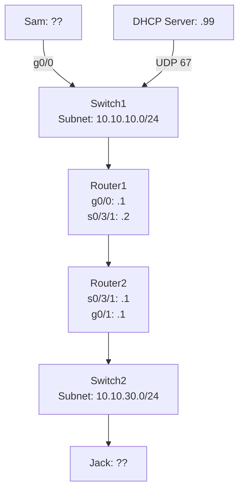

### IPv4 and IPv6 Manual Configuration

- Historically, devices required **manual IP configuration**:
    - IP address
    - Subnet mask
    - Default gateway
    - DNS servers
    - NTP servers
- Manual setup doesn’t scale: managing thousands of devices by hand is error-prone and inefficient.
- The need: **automated, hands-off IP configuration**.
    

---

### Dynamic Host Configuration Protocol (DHCP)

- First released in **1997**; updated several times since.
- Provides **automatic IP configuration** for almost all devices.
- Eliminates the need for manual IP settings, supporting scalability and flexibility.
    

---

### DORA Process

The DHCP process follows **DORA**:

1. **Discover** – Client broadcasts to find available DHCP servers.
2. **Offer** – Server responds with an available IP address offer.
3. **Request** – Client requests to use the offered IP.
4. **Acknowledge** – Server confirms the lease and sends configuration details.

- **DHCP Server** is reachable via **UDP port 67**.
- Clients like Sam and Jack will obtain IPs automatically through this network.

### DHCP Scope

- Defines the **range of IP addresses** the DHCP server can assign.
- Includes:
    - IP address range
    - **Excluded addresses** (for static devices like routers, servers)
    - Subnet mask
    - Lease duration
    - Optional parameters:
        - DNS servers
        - Default gateway            
        - VoIP servers
            

---

### Address Reservation

- Maps a **specific MAC address to a fixed IP**.
- Also called:
    - Static DHCP assignment
    - IP reservation
- Ensures important devices always receive the same IP while still using DHCP.